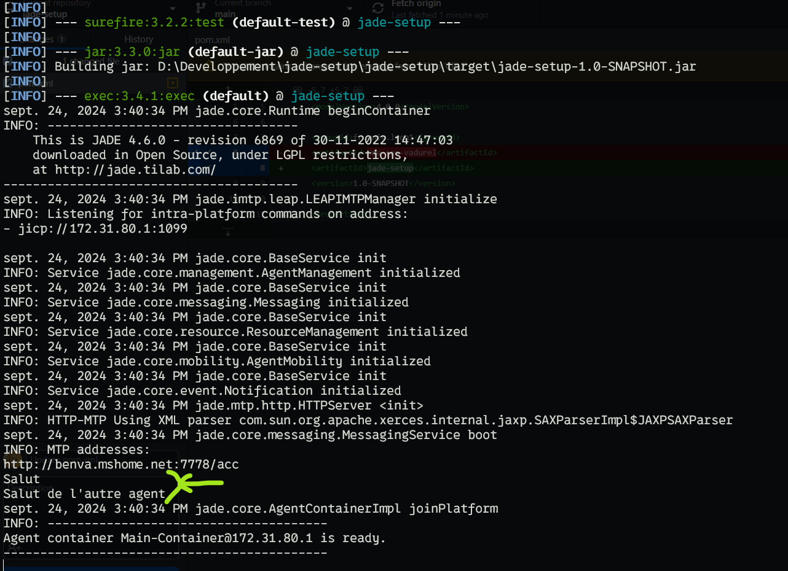

# Jade Setup

Uses Jade Lib : https://jade.tilab.com/download/jade/.

This project implements the package testAgent, with 2 agents class (OtherAgent, TestAgent) as example.

## Requirements
- Maven

## Setup
- Clone the project
- Place yourself in the root directory
- Run `mvn clean package -Dagents="<Container-name>:<agent-class>"`, each agent must be seperated by semicolons
Example : `mvn clean package -Dagents="Testing:fr.univ.lyon1.agents.testAgent.OtherAgent;OT:fr.univ.lyon1.agents.testAgent.TestAgent;"`

You can also specify agents references in `pom.xml` file, in `<properties>` `<agents>` (line 15) and run `mvn clean package`.
The agent must be specified like below : 
`<Container-name>:<agent-class>` with each agent seperated by semicolons.

If everything work as expected, the output should look like : 


## FAQ

### How to stop the container

To stop the container, you shouldn't use Ctrl+C on terminal but instead use File > Shutdown Agent Platform on the GUI. 


Otherwise, you'll encounter the following error : 
```
SEVERE: Communication failure while joining agent platform: No ICP active
jade.core.IMTPException: No ICP active
        at jade.imtp.leap.LEAPIMTPManager.initialize(LEAPIMTPManager.java:138)
        at jade.core.AgentContainerImpl.init(AgentContainerImpl.java:321)
        at jade.core.AgentContainerImpl.joinPlatform(AgentContainerImpl.java:500)
        at jade.core.Runtime.createMainContainer(Runtime.java:159)
        at jade.Boot.main(Boot.java:89)
```